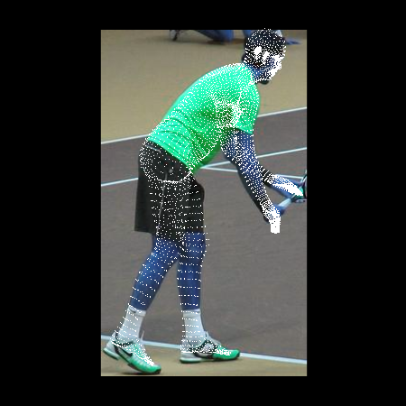
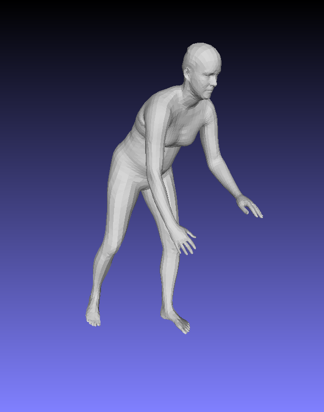

# im2smpl
Predicts a SMPL model given a RGB image using clues from HMR, Simplify, AlphaPose, etc. 

### Setup
1. clone this repository:
```sh
git clone https://github.com/ZhengZerong/im2smpl.git
cd ./im2smpl
```

2. Setup AlphaPose in `./AlphaPose/` according to [this guidance](https://github.com/MVIG-SJTU/AlphaPose/blob/master/README.md#installation). 
After that, run the official demo script (`./AlphaPose/run.sh`) to make sure AlphaPose is properly setup. 

3. Setup HMR in `./HMR/` according to [this guidance](https://github.com/akanazawa/hmr/blob/master/README.md). 
After that, run the official demo script (`./HMR/demo.py`) to make sure HMR is properly setup. 

4. Setup LIP in `./LIP_JPPNet/` according to [this guidance](https://github.com/Engineering-Course/LIP_JPPNet/blob/master/README.md). 
After that, run the official demo script (`./LIP_JPPNet/evaluate_parsing_JPPNet-s2.py`) to make sure LIP is properly setup.  

5. If setup properly, the folder structure should look like:
```
    .
    ├── AlphaPose/
        ├── doc/
        ├── examples/
        ├── human-detection/
        ├── PoseFlow/
        └── ...
    ├── example/
    ├── hmr/
        ├── data/
        ├── doc/
        ├── models/
        ├── src/
        ├── __init__.py
        ├── demo.py
        └── ...
    ├── LIP_JPPNet/
        ├── checkpoint/
        ├── datasets/
        ├── kaffe/
        ├── utils/
        ├── __init__.py
        ├── evaluate_parsing_JPPNet-s2.py
        └── ...
    ├── smplify_public/
        ├── code/
        ├── README.md
        ├── requirements.txt
    ├── detect_bbox_by_parsing.py
    ├── detect_human.py
    ├── fit_3d_accurate.py
    ├── infer_smpl.py
    └── ...
```

### Usage
Run the following command:
```sh
python main.py --img_file ./path/to/image --out_dir ./path/to/output/directory/
# for example: python main.py --img_file ./example/1.png --out_dir ./example/
```
Or modify the parameters in the provided script `main.sh` and simply run:
```sh
sh main.sh
```

### Results
(See `./example/` for more details. )
<p align="center">
 
 
</p>


### License
1. This code utilizes several open-source projects including 
AlphaPose(in ```./AlphaPose/```), HMR(in ```./hmr/```), LIP(in ```./LIP_JPPPNet/```) 
and SMPLify(in ```./smplify_public/```). 
They fall under [AlphaPose Liicense](https://github.com/MVIG-SJTU/AlphaPose/blob/master/LICENSE), 
[MIT License](https://github.com/akanazawa/hmr/blob/master/LICENSE), 
[MIT License](https://github.com/Engineering-Course/LIP_JPPNet/blob/master/LICENSE) and 
[SMPLIFY License](http://smplify.is.tue.mpg.de/data_license), respectively. 
By using this repository you agree to follow these licenses. 

2. The other part of the code falls under the following license:

> Copyright (c) 2019 Zerong Zheng, Tsinghua University
>
>Please read carefully the following terms and conditions and any accompanying documentation before you download and/or use this software and associated documentation files (the "Software").
>
>The authors hereby grant you a non-exclusive, non-transferable, free of charge right to copy, modify, merge, publish, distribute, and sublicense the Software for the sole purpose of performing non-commercial scientific research, non-commercial education, or non-commercial artistic projects.
>
>Any other use, in particular any use for commercial purposes, is prohibited. This includes, without limitation, incorporation in a commercial product, use in a commercial service, or production of other artefacts for commercial purposes.
>
>THE SOFTWARE IS PROVIDED "AS IS", WITHOUT WARRANTY OF ANY KIND, EXPRESS OR IMPLIED, INCLUDING BUT NOT LIMITED TO THE WARRANTIES OF MERCHANTABILITY, FITNESS FOR A PARTICULAR PURPOSE AND NONINFRINGEMENT. IN NO EVENT SHALL THE AUTHORS OR COPYRIGHT HOLDERS BE LIABLE FOR ANY CLAIM, DAMAGES OR OTHER LIABILITY, WHETHER IN AN ACTION OF CONTRACT, TORT OR OTHERWISE, ARISING FROM, OUT OF OR IN CONNECTION WITH THE SOFTWARE OR THE USE OR OTHER DEALINGS IN THE SOFTWARE.
>
>You understand and agree that the authors are under no obligation to provide either maintenance services, update services, notices of latent defects, or corrections of defects with regard to the Software. The authors nevertheless reserve the right to update, modify, or discontinue the Software at any time.
>
>The above copyright notice and this permission notice shall be included in all copies or substantial portions of the Software. You agree to cite the DeepHuman: 3D Human Reconstruction from a Single Image paper in documents and papers that report on research using this Software.

### Citation
If you find the code useful in your work, you should cite the following papers:
```
@inproceedings{Bogo:ECCV:2016,
  title = {Keep it {SMPL}: Automatic Estimation of {3D} Human Pose and Shape
  from a Single Image},
  author = {Bogo, Federica and Kanazawa, Angjoo and Lassner, Christoph and
  Gehler, Peter and Romero, Javier and Black, Michael J.},
  booktitle = {Computer Vision -- ECCV 2016},
  series = {Lecture Notes in Computer Science},
  publisher = {Springer International Publishing},
  month = oct,
  year = {2016}
}      

@inProceedings{kanazawaHMR18,
  title={End-to-end Recovery of Human Shape and Pose},
  author = {Angjoo Kanazawa
  and Michael J. Black
  and David W. Jacobs
  and Jitendra Malik},
  booktitle={Computer Vision and Pattern Regognition (CVPR)},
  year={2018}
}

@article{liang2018look,
  title={Look into Person: Joint Body Parsing \& Pose Estimation Network and a New Benchmark},
  author={Liang, Xiaodan and Gong, Ke and Shen, Xiaohui and Lin, Liang},
  journal={IEEE Transactions on Pattern Analysis and Machine Intelligence},
  year={2018},
  publisher={IEEE}
}

@inproceedings{xiu2018poseflow,
  title = {{Pose Flow}: Efficient Online Pose Tracking},
  author = {Xiu, Yuliang and Li, Jiefeng and Wang, Haoyu and Fang, Yinghong and Lu, Cewu},
  booktitle={BMVC},
  year = {2018}
}
```
